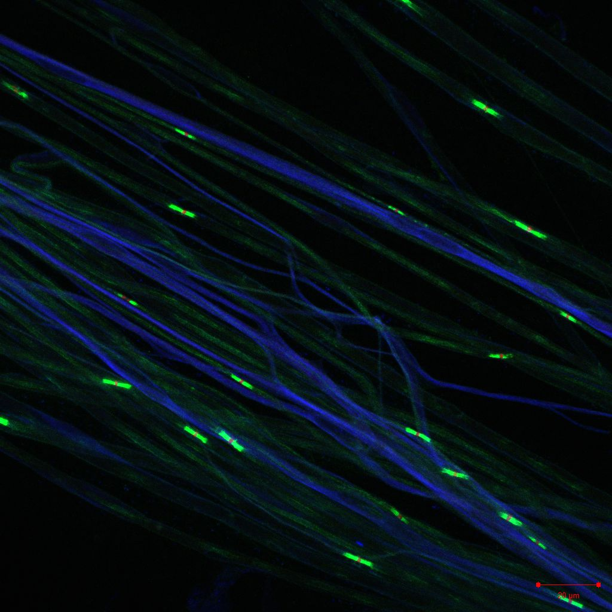

## Personal Web Page
I'm researching gliomedin in demyelination of PNS mouse models in [Prof. Ori Peles lab](https://www.weizmann.ac.il/mcb/peles/)

This is a siatic nerve of a mouse

Cool, right?

During my M.SC I studied B cell subtypes of Down Syndrome mouse model and their effect on Alzheimer's Disease.

## Fun Fact
- My favorite pizza topping is pineapple.

  

## Contact Me
Feel free to reach out:
- [E-mail](karin.vardy@weizmann.ac.il)
- [LinkedIn](https://www.linkedin.com/in/karin-vardy-1990b3256)

